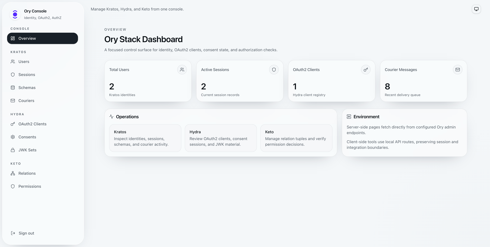

# Ory Console



**Ory Console** is an open-source admin dashboard for managing an Ory stack from one modern interface. It provides a clean web UI for **Ory Kratos** identity management, **Ory Hydra** OAuth2 administration, and **Ory Keto** authorization checks and relation tuples.

Built with **Next.js App Router**, **React**, **Tailwind CSS**, and **shadcn/ui**, Ory Console is designed for teams that want a practical, self-hosted dashboard for inspecting identities, sessions, OAuth2 clients, consent sessions, JWK sets, courier messages, Keto relations, and permission decisions.

## Features

- **Ory Kratos dashboard**
  - Browse identities and identity schemas
  - Inspect user traits and metadata
  - View and revoke sessions
  - Review courier messages and retry failed delivery

- **Ory Hydra dashboard**
  - List OAuth2 clients
  - Inspect client details, grant types, scopes, redirect URIs, and raw JSON
  - Review consent sessions by subject
  - Revoke one consent grant or all grants for a subject
  - Inspect configured JWK sets

- **Ory Keto dashboard**
  - Search relation tuples
  - Create and delete relation tuples
  - Check permission decisions using namespace, object, relation, and subject

- **Modern dashboard UI**
  - Minimal glassmorphism-inspired interface
  - Light mode, dark mode, and system theme support
  - Responsive sidebar navigation
  - Accessible shadcn/ui primitives

## Why Ory Console?

Ory is powerful, but day-to-day operations often need a simple dashboard for debugging and administration. Ory Console gives developers and platform teams a focused UI for common operational workflows across Kratos, Hydra, and Keto without replacing the Ory APIs or configuration files.

Use it for local development, staging environments, internal admin tooling, and observability-style inspection of your Ory identity and authorization stack.

## Tech Stack

- Next.js 16 App Router
- React 19
- Tailwind CSS 4
- shadcn/ui and Base UI primitives
- Lucide icons
- next-themes
- iron-session
- Docker and Docker Compose

## Getting Started

### Prerequisites

- Node.js 20 or newer
- npm
- Docker and Docker Compose
- Running Ory services:
  - Kratos Admin API
  - Hydra Admin API
  - Keto Read API
  - Keto Write API

## Environment Variables

Create a local environment file:

```bash
cp .env.example .env.local
```

Update the values for your environment:

```env
# Ory admin API endpoints
KRATOS_ADMIN_URL=http://localhost:4434
HYDRA_ADMIN_URL=http://localhost:4445
KETO_READ_URL=http://localhost:4466
KETO_WRITE_URL=http://localhost:4467

# Session security
SESSION_SECRET=replace-with-a-random-32-character-minimum-secret
SESSION_COOKIE_NAME=ory_console_session

# Dashboard login credentials
ADMIN_EMAIL=admin@example.com
ADMIN_PASSWORD=change-this-password
```

### Variable Reference

| Variable              | Required | Description                                                                           |
| --------------------- | -------- | ------------------------------------------------------------------------------------- |
| `KRATOS_ADMIN_URL`    | Yes      | URL for the Ory Kratos Admin API.                                                     |
| `HYDRA_ADMIN_URL`     | Yes      | URL for the Ory Hydra Admin API.                                                      |
| `KETO_READ_URL`       | Yes      | URL for the Ory Keto Read API.                                                        |
| `KETO_WRITE_URL`      | Yes      | URL for the Ory Keto Write API.                                                       |
| `SESSION_SECRET`      | Yes      | Secret used by `iron-session`. Use a strong random value with at least 32 characters. |
| `SESSION_COOKIE_NAME` | No       | Cookie name for the dashboard session.                                                |
| `ADMIN_EMAIL`         | Yes      | Email used to sign in to Ory Console.                                                 |
| `ADMIN_PASSWORD`      | Yes      | Password used to sign in to Ory Console.                                              |

## Run Locally

Install dependencies:

```bash
npm install
```

Start the development server:

```bash
npm run dev
```

Open:

```text
http://localhost:3000
```

If port `3000` is already in use, Next.js may choose another available port.

## Run With Docker

The included `docker-compose.yml` builds and runs Ory Console as a container.

### 1. Create or join the Ory Docker network

The compose file expects an external Docker network named `votz_ory`:

```bash
docker network create votz_ory
```

If your Ory services already run on another Docker network, update `docker-compose.yml`:

```yaml
networks:
  ory:
    external: true
    name: your_ory_network_name
```

### 2. Configure Docker environment values

The Docker Compose file reads these host environment variables:

```bash
export OC_SESSION_SECRET="replace-with-a-random-32-character-minimum-secret"
export OC_ADMIN_EMAIL="admin@example.com"
export OC_ADMIN_PASSWORD="change-this-password"
```

Inside Docker, the dashboard connects to Ory services by service name:

```env
KRATOS_ADMIN_URL=http://kratos:4434
HYDRA_ADMIN_URL=http://hydra:4445
KETO_READ_URL=http://keto:4466
KETO_WRITE_URL=http://keto:4467
```

Make sure your Kratos, Hydra, and Keto containers are attached to the same Docker network and use the service names `kratos`, `hydra`, and `keto`, or update the compose file to match your service names.

### 3. Start the dashboard

```bash
docker compose up --build
```

Open:

```text
http://localhost:3001
```

The default compose mapping is:

```yaml
ports:
  - "3001:3000"
```

## Production Notes

- Do not use default admin credentials in production.
- Use a strong random `SESSION_SECRET`.
- Put Ory Console behind your internal VPN, zero-trust proxy, or private network.
- Expose only the dashboard HTTP port. Ory admin APIs should remain private.
- Prefer HTTPS in production.
- Treat this dashboard as privileged infrastructure because it can inspect and mutate identity, OAuth2, and authorization data.

## Common Workflows

### Inspect a Kratos User

1. Open **Users**.
2. Select an identity.
3. Review schema, state, traits, and sessions.
4. Revoke one session or all sessions when needed.

### Review Hydra OAuth2 Clients

1. Open **OAuth2 Clients**.
2. Select a client.
3. Review grant types, scopes, redirect URIs, token endpoint auth method, and raw client JSON.

### Check a Keto Permission

1. Open **Permissions**.
2. Enter namespace, object, relation, and subject ID.
3. Run the check to see whether Keto returns `ALLOWED` or `DENIED`.

### Manage Keto Relations

1. Open **Relations**.
2. Search by namespace, relation, or subject ID.
3. Add or delete relation tuples.

## Development

Run lint:

```bash
npm run lint
```

Build for production:

```bash
npm run build
```

Start the production server after building:

```bash
npm run start
```

## Project Structure

```text
app/
  api/                  Local API routes for Kratos, Hydra, Keto, and auth
  dashboard/            Dashboard pages
components/
  ui/                   shadcn/ui components
  nav-sidebar.tsx       Dashboard navigation
  data-table.tsx        Reusable table wrapper
lib/
  ory/                  Ory API clients
  session.ts            Session helpers
```

## Roadmap

- Create and edit OAuth2 clients from the UI
- Advanced identity search and filters
- Relation tuple import/export
- Audit-friendly activity views
- Role-based access for dashboard users
- Helm chart and production deployment examples

## Contributing

Contributions are welcome. This project is intended to be useful for the Ory community and for teams running self-hosted identity infrastructure.

Good contribution areas include:

- UI and UX improvements
- Accessibility fixes
- Kratos, Hydra, and Keto workflow improvements
- Docker and deployment examples
- Documentation and screenshots
- Tests and type-safety improvements
- Bug reports with reproducible steps

Before opening a pull request:

1. Create a focused branch.
2. Keep changes scoped and easy to review.
3. Run `npm run lint`.
4. Run `npm run build`.
5. Document user-facing behavior changes.

## Discoverability

Ory Console, Ory dashboard, Ory Kratos dashboard, Ory Hydra dashboard, Ory Keto dashboard, open-source identity management dashboard, OAuth2 admin dashboard, authorization dashboard, self-hosted Ory admin UI, Kratos identity UI, Hydra OAuth2 clients UI, Keto permission management UI.

## License

This project is released under the [MIT License](LICENSE).

## Acknowledgements

Ory Console builds on the excellent Ory ecosystem:

- [Ory Kratos](https://www.ory.sh/kratos/)
- [Ory Hydra](https://www.ory.sh/hydra/)
- [Ory Keto](https://www.ory.sh/keto/)

This project is community-oriented and is not an official Ory product unless explicitly stated by Ory.
